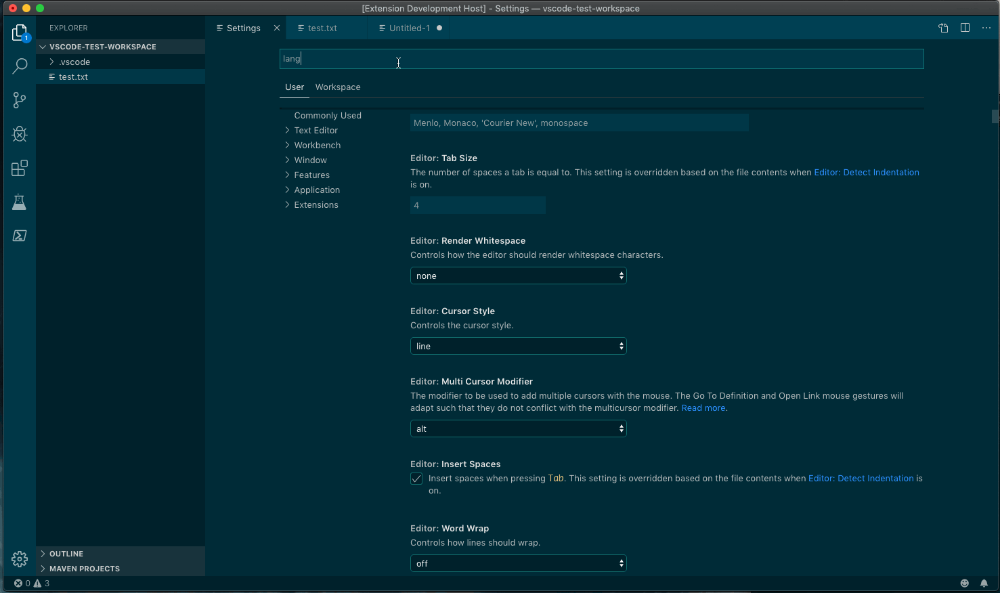
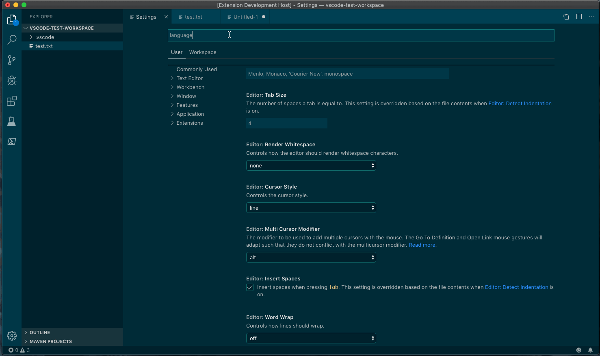
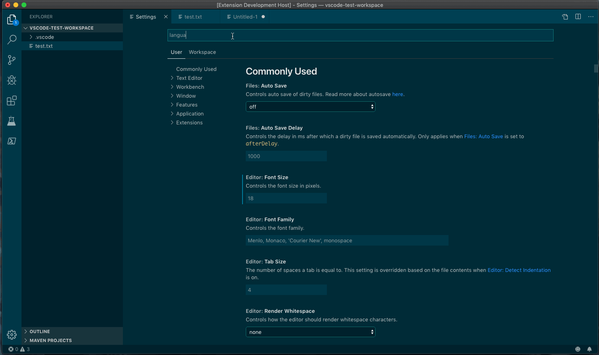

# LanguageTool Linter for Visual Studio Code

Grammar, Style and Spell Checking in VS Code via
[LanguageTool](https://languagetool.org). Support Markdown, MDX, HTML, and plain
text files.

In memory of [Adam Voss](https://github.com/adamvoss), original creator of the
[LanguageTool for Visual Studio Code](https://github.com/languagetool-language-server/vscode-languagetool)
extension.

## Features

- Issue highlighting with hover description.
- Replacement suggestions.
- Checks plain text, Markdown, MDX, and HTML.
- Smart format on type to replace quotes with smart quotes, multiple consecutive
  hyphens with em or en-dash, and three consecutive periods with ellipses.
  - Make sure 'Editor: Format On Type' is enabled or this feature won't work.
    You can enable it at the document format level as well in your
    `settings.json`.
- Allow specific rules to be ignored for markdown (pandoc) and HTML

## Setup

The defaults are probably not going to work for you, but they are there to make
sure using
[LanguageTool's Public API](https://dev.languagetool.org/public-http-api) is
done by choice. See
[this issue](https://github.com/wysiib/linter-languagetool/issues/33) on the
[Atom LanguageTool Linter](https://atom.io/packages/linter-languagetool) for an
explanation why.

The defaults assume the following:

1. You do not want to use the
   [LanguageTool's Public API](https://dev.languagetool.org/public-http-api)
2. You're running
   [LanguageTool HTTP Server](https://dev.languagetool.org/http-server) on your
   machine using the default port of 8081.

   - You can run a local LanguageTool server using the
     [unofficial Docker image](https://github.com/silvio/docker-languagetool)
     with `docker run --rm -p 8081:8010 silviof/docker-languagetool`. See
     [silvio/docker-languagetool](https://github.com/silvio/docker-languagetool)
     for more information.

3. You do not want to have this extension manage your local
   [LanguageTool HTTP Server](https://dev.languagetool.org/http-server) service.

If this doesn't work for you, here are your options.

### Option 1: Use an External Service

This could either be a
[locally running instance](https://github.com/davidlday/vscode-languagetool-linter/wiki#run-a-local-languagetool-service)
of LanguageTool, or the service running somewhere else.

1. Set the URL in “LanguageTool Linter > External: URL” (i.e.
   `http://localhost:8081`).
1. Set “LanguageTool Linter: Service Type” to `external`.

### Option 2: Use an Extension-Managed Service

Works well if you're only using LanguageTool in Visual Studio Code.

1. [Install LanguageTool](https://github.com/davidlday/vscode-languagetool-linter/wiki#installing-languagetool)
   locally.
1. Set “LanguageTool Linter > Managed: Class Path” to the location of the
   `languagetool-server.jar` file. The install doc has hints.
1. Set “LanguageTool Linter: Service Type” to `managed`.

### Option 3: Public API Service

Make sure you read and understand
[LanguageTool's Public API](https://dev.languagetool.org/public-http-api) before
doing this.

1. Set “LanguageTool Linter: Service Type” to `public`.

## Configuration Notes

Most configuration items should be safe, but there are three you should pay
particular attention to:

1. _Public Api_: This will use
   [LanguageTool's Public API](https://dev.languagetool.org/public-http-api)
   service. If you violate their conditions, they'll block your IP address.
2. _Lint on Change_: This will make a call to the LanguageTool API on every
   change. If you mix this with the _Public Api_, you're more likely to violate
   their conditions and get your IP address blocked.
3. _LanguageTool: Preferred Variants_: If you set this, then _LanguageTool:
   Language_ must be set to `auto`. If it isn't, the service will throw an
   error.

## Ignore rules inline

You have the chance to ignore specific rules inline to not bloat up your ignore
list for single words:

    <!-- @IGNORE:UPPERCASE_SENTENCE_START@ -->
    soll heißen, dass die Nachricht von mir ist, die Koordinaten hat
    ein kleiner Computer, den Sigrún mir zur Verfügung gestellt hat aus
    dem irdischen
    ‚World Geodetic System 1984‘ <!-- @IGNORE:GERMAN_SPELLER_RULE(Geodetic)@ -->

This example will ignore the missing capital letter at the beginning (soll →
Soll) and an unknown word ('Geodetic')

The optional match word is useful if the same rule is applied to several words
in the sentence.

The rules can be applied to the current line (e.g. at the end) or at the line
before.

Syntax:

    @LT-IGNORE:<rulename>(<text-match>)@

The and the `text-match` is optional.

_Note_: Even in pandoc you have to handle the comment in html output. This can
be done by using a filter.

## Credits

The following projects provided excellent guidance on creating this project.

<!-- markdownlint-disable no-inline-html -->

- [LanguageTool](https://languagetool.org) (of course!)
- [Atom Linter LanguageTool](https://github.com/wysiib/linter-languagetool/)
- [LTeX](https://github.com/valentjn/vscode-ltex) — a fork of
  [LanguageTool for Visual Studio Code](https://github.com/languagetool-language-server/vscode-languagetool)
- [VS Code Write Good Extension](https://github.com/TravisTheTechie/vscode-write-good/)
- [Fall: Not Yet Another Parser Generator](https://github.com/matklad/fall)
- [markdownlint](https://github.com/DavidAnson/vscode-markdownlint)

<!-- markdownlint-enable no-inline-html -->
