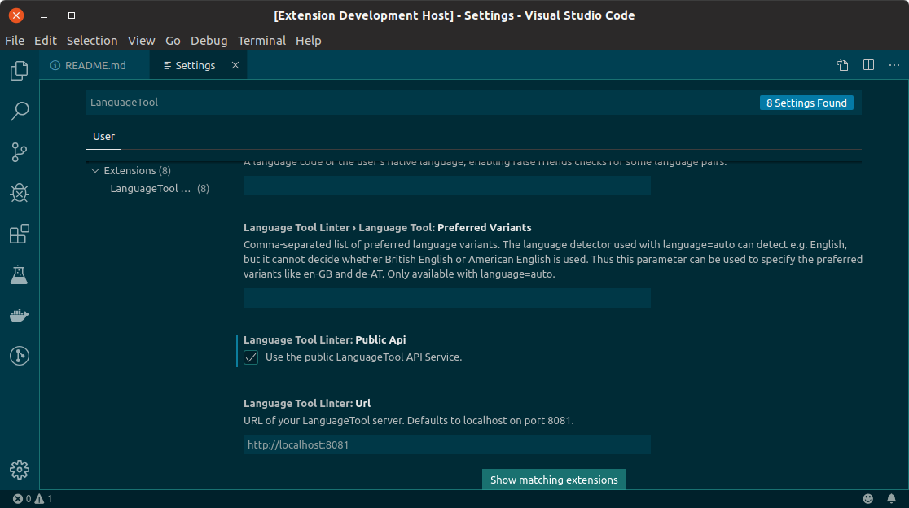
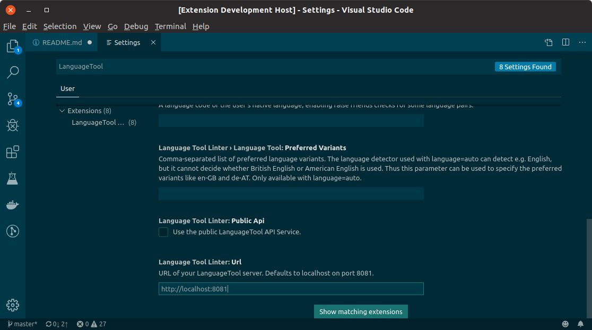

# VS Code LanguageTool Linter

Grammar, Style and Spell Checking in VS Code via [LanguageTool](https://languagetool.org). Support Markdown, HTML, and plain text files.

## Setup

The defaults are probably not going to work for you, but they are there to make sure using [LanguageTool's Public API](http://wiki.languagetool.org/public-http-api) is done by choice. See [this issue](https://github.com/wysiib/linter-languagetool/issues/33) on the [Atom LanguageTool Linter](https://atom.io/packages/linter-languagetool) for details.

The defaults assume the following:

1. You do not want to use the [LanguageTool's Public API](http://wiki.languagetool.org/public-http-api)
1. You're running [LanguageTool HTTP Server](http://wiki.languagetool.org/http-server) on your machine using the default port of 8081.
1. You do not want to have this extension manage your local [LanguageTool HTTP Server](http://wiki.languagetool.org/http-server) service.

### Option 1: Public API

Make sure you read and understand [LanguageTool's Public API](http://wiki.languagetool.org/public-http-api) before doing this.

In Settings, search for “LanguageTool”, and enable the "Language Tool Linter: Public Api" option.



### Option 2: Use a locally installed LanguageTool HTTP Server

This is how I'm configured since I use both VSCode and Atom and don't want them each managing their own services.

1. Install [LanguageTool](https://languagetool.org).
   * On Mac, use [HomeBrew](https://brew.sh): `brew install languagetool`
   * On Ubuntu, use [LinuxBrew](https://linuxbrew.sh): `brew install languagetool`
   * On Windows, use [Scoop](https://scoop.sh): `scoop install languagetool`
1. Start the service on Login
   * On Mac, create a LaunchAgent that points to `/opt/bin/languagetool-server`. See [my plist](https://github.com/davidlday/dotfiles/blob/master/LaunchAgents/org.languagetool.server.HTTPServer.plist).
   * On Ubuntu, create a [Startup Application](https://askubuntu.com/questions/48321/how-do-i-start-applications-automatically-on-login) that points to `/home/linuxbrew/.linuxbrew/bin/languagetool-server`
   * On Windows, I don't know yet, but I'll post an option once I have one.

That should get you working.

### Option 3: Have this Extension Manage a Local LanguageTool HTTP Server

This option is coming. It's how [LanguageTool HTTP Server](http://wiki.languagetool.org/http-server) behaves by default.

### Option 4: Use LanguageTool API Running Somewhere Else

In Settings, search for “LanguageTool”, and set the "Language Tool Linter: Url" option.



## Configuration

```JSON
        "languageToolLinter.enabled": {
          "type": "boolean",
          "default": true,
          "description": "Allow to enable languageTool on specific workspaces"
        },
        "languageToolLinter.languageTool.language": {
          "type": "string",
          "default": "auto",
          "description": "A language code like en-US, de-DE, fr, or auto to guess the language automatically (see preferredVariants below). For languages with variants (English, German, Portuguese) spell checking will only be activated when you specify the variant, e.g. en-GB instead of just en."
        },
        "languageToolLinter.languageTool.motherTongue": {
          "type": "string",
          "default": "",
          "description": "A language code of the user's native language, enabling false friends checks for some language pairs."
        },
        "languageToolLinter.languageTool.preferredVariants": {
          "type": "string",
          "default": "",
          "description": "Comma-separated list of preferred language variants. The language detector used with language=auto can detect e.g. English, but it cannot decide whether British English or American English is used. Thus this parameter can be used to specify the preferred variants like en-GB and de-AT. Only available with language=auto."
        },
        "languageToolLinter.languageTool.disabledRules": {
          "type": "string",
          "default": "",
          "description": "IDs of rules to be disabled, comma-separated."
        },
        "languageToolLinter.languageTool.disabledCategories": {
          "type": "string",
          "default": "",
          "description": "IDs of categories to be disabled, comma-separated."
        },
        "languageToolLinter.publicApi": {
          "type": "boolean",
          "default": false,
          "description": "Use the public LanguageTool API Service."
        },
        "languageToolLinter.url": {
          "type": "string",
          "default": "http://localhost:8081",
          "description": "URL of your LanguageTool server. Defaults to localhost on port 8081."
        }
```

## Credits

The following projects provided excellent guidance on creating this project.

* [Atom Linter LanguageTool](https://github.com/wysiib/linter-languagetool/)
* [VSCode Write Good Extension](https://github.com/TravisTheTechie/vscode-write-good/)
* [Fall: Not Yet Another Parser Generator](https://github.com/matklad/fall)
* [LaguageTool](https://languagetool.org) (of course!)
